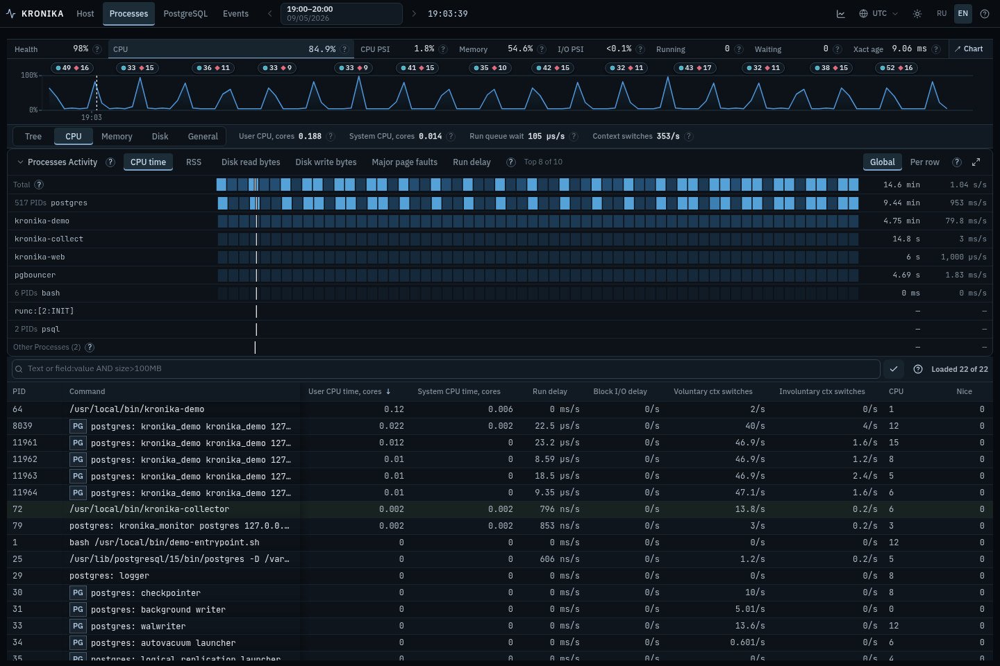
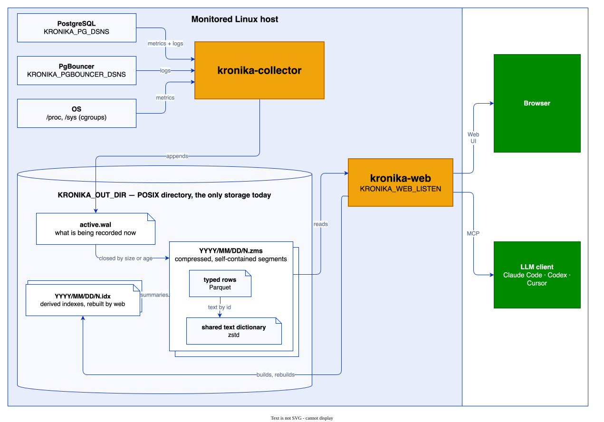

# Kronika

[English version](README.md)

Kronika записывает метрики процессов и хоста Linux, статистику PostgreSQL,
планы запросов и события логов PostgreSQL/PgBouncer. Collector пишет локальные
журналы и сжатые сегменты; web показывает выбранный час, snapshots на момент
курсора и историю объектов.



[Открыть интерактивный пример](https://vadv.github.io/kronika-reports/reports/kronika-demo-hour-b3ac3ee.html).

## Установка и запуск

Можно установить [готовую сборку для Linux](INSTALL.ru.md) или
[собрать из исходников](docs/build.ru.md). Архив содержит `kronika-collector`,
`kronika-web`, `kronika-dump` и `kronika-report`.

После установки запустите сбор на наблюдаемой машине:

```sh
sudo install -d -m 0700 /var/lib/kronika
sudo env KRONIKA_STORAGE_DIR=/var/lib/kronika \
  /usr/local/bin/kronika-collector
```

Во втором терминале запустите web с тем же каталогом:

```sh
sudo env KRONIKA_STORAGE_DIR=/var/lib/kronika \
  KRONIKA_WEB_LISTEN=127.0.0.1:8080 \
  KRONIKA_WEB_SOURCES=1 \
  KRONIKA_WEB_USER=kronika \
  KRONIKA_WEB_PASSWORD='replace-with-a-random-password' \
  /usr/local/bin/kronika-web
```

Откройте <http://127.0.0.1:8080/> и войдите. Web читает активный журнал во время
сбора. `Ctrl+C` останавливает любой из процессов и сохраняет запись.
[Units systemd](docs/services.ru.md) запускают обе программы как сервисы.

### Локальный и удалённый PostgreSQL

После [настройки monitoring role](INSTALL.ru.md#5-postgresql) остановите
collector и выберите подключение. Для локального PostgreSQL в той же VM или
с теми же ограничениями ресурсов контейнера `KRONIKA_POSTGRES_EFFECTIVE_CPUS`
не задаётся: ёмкость CPU вычисляется по записанным CPU snapshots или quota/cpuset.

```sh
sudo env KRONIKA_STORAGE_DIR=/var/lib/kronika \
  KRONIKA_PG_DSNS='host=127.0.0.1 port=5432 user=kronika_monitor password=replace-with-password dbname=postgres' \
  /usr/local/bin/kronika-collector
```

Для удалённого PostgreSQL или PostgreSQL в другом cgroup задайте доступную
именно ему ёмкость CPU. Пример для PostgreSQL с 4 CPU:

```sh
sudo env KRONIKA_STORAGE_DIR=/var/lib/kronika \
  KRONIKA_PG_DSNS='host=pg.example.net port=5432 user=kronika_monitor password=replace-with-password dbname=postgres' \
  KRONIKA_POSTGRES_EFFECTIVE_CPUS=4 \
  /usr/local/bin/kronika-collector
```

Режим подключения задаётся этими условиями размещения; адрес DSN их не
определяет. Перезапустите web с `KRONIKA_WEB_SOURCES=3` для OS и PostgreSQL.

### Место на диске

Ориентир для PostgreSQL с примерно 500 таблицами и 3000 индексами —
**около 200 MB сжатых записей в сутки**. Объём зависит от интервалов сбора,
числа записываемых объектов и уникальных запросов.

`KRONIKA_RETENTION=2147483648` задаёт бюджет хранения **2 GiB** по умолчанию,
включая журналы и индексы. При превышении целевого объёма collector автоматически
удаляет самые старые завершённые записи вместе с их индексами.
Для **10 GiB** задайте `KRONIKA_RETENTION=10737418240` (значение в байтах).

`auto` и `auto:P` вместо фиксированного объёма задают целевую долю занятого места
на всей файловой системе хранилища. Правила ротации и автоматический режим —
в [настройках хранения](bins/kronika-collector/README.ru.md#storage).

## Данные и представления

| Область | Представления и значения | Справочник |
| --- | --- | --- |
| Processes | General, Tree, CPU, Memory, Disk; counters и rates по PID, команда и status; активность за час и история. | [Метрики Linux](docs/metrics-linux.ru.md) |
| Host | CPU, memory, PSI, network, counters дисков, ёмкость filesystem, топология mounts/devices; CPU, memory, I/O и threads cgroup контейнера. | [Метрики Linux](docs/metrics-linux.ru.md) |
| Сессии PostgreSQL | Overview, Activity, Locks, Vacuum; состояния backend, waits, цепочки блокировок, возраст транзакций/запросов и ход maintenance. | [Метрики PostgreSQL](docs/metrics-postgresql.ru.md) |
| SQL PostgreSQL | Statements и Plans; calls, время execution/planning, buffers, temporary I/O, WAL, записанные SQL и текст плана. | [Метрики PostgreSQL](docs/metrics-postgresql.ru.md) |
| Объекты PostgreSQL | Databases, Tables, Indexes и settings; traffic, size, scans, changes, maintenance counters, возраст транзакций и группы по database/schema/tablespace. | [Метрики PostgreSQL](docs/metrics-postgresql.ru.md) |
| Events | Группы событий логов PostgreSQL/PgBouncer, отдельные события, длительности и записанный контекст; metric marks. | [Представления и controls](docs/features.ru.md) |
| Время и charts | Календарный час, курсор, выбор samples, интервальные вычисления, heatmaps, totals и percentiles. | [Время и вычисления](docs/metrics-time.ru.md) |

[Представления и controls](docs/features.ru.md) определяют навигацию, lenses,
grouping, поиск, сортировку, Inspector, charts и Export.
[Руководство оператора](docs/operator-guide.ru.md) содержит четыре расчётных
примера из записи выше.


## Сбор и доступ

<picture>
  <source media="(prefers-color-scheme: dark)" srcset="docs/images/architecture-dark.svg">
  
</picture>

Интервалы сбора по умолчанию: процессы — 5 секунд, основные метрики Linux —
10 секунд, метрики PostgreSQL — 30 секунд, relations — 300 секунд.
[Конфигурация collector](bins/kronika-collector/README.ru.md) определяет scope
источников, интервалы, права и ротацию хранения.

Web обслуживает браузер, HTTP API и MCP на одном listener. Панель **AI**
содержит параметры подключения MCP-клиентов. [MCP tools](docs/features.ru.md#mcp)
читают snapshots, rankings, field definitions, events и полные row details.

## Переносимый HTML-экспорт

**Export** сохраняет выбранный интервал вашей записи в один интерактивный
HTML-файл. Он содержит интерфейс, данные и Rust/WebAssembly query engine,
который выполняется на основном потоке браузера. Для открытия файла не нужны
сервер или сетевое подключение.

<picture>
  <source media="(prefers-color-scheme: dark)" srcset="docs/images/report-export-dark.svg">
  
</picture>

[kronika-dump](bins/kronika-dump/README.ru.md) читает хранилище и извлекает
интервал в ZMS; [kronika-report](bins/kronika-report/README.ru.md) преобразует
отдельный ZMS в HTML. Offline reports предоставляют локальные таблицы, поиск,
charts и heatmaps.

## Документация

- Настройка: [Установка](INSTALL.ru.md) · [Архивы и CI](docs/releases.ru.md) · [Сервисы](docs/services.ru.md) · [Сборка](docs/build.ru.md)
- Справочники: [Controls](docs/features.ru.md) · [Время](docs/metrics-time.ru.md) · [Linux](docs/metrics-linux.ru.md) · [PostgreSQL](docs/metrics-postgresql.ru.md) · [MCP](docs/mcp-clients.ru.md)
- Программы: [Collector](bins/kronika-collector/README.ru.md) · [Web](bins/kronika-web/README.ru.md) · [Dump](bins/kronika-dump/README.ru.md) · [Report](bins/kronika-report/README.ru.md)
- Записанные поля: [Linux](docs/type-registry/os.ru.md) · [Метрики PostgreSQL](docs/type-registry/postgresql-metrics.ru.md) · [События PostgreSQL](docs/type-registry/postgresql.md) · [События PgBouncer](docs/type-registry/pgbouncer.md)
- Устройство: [Контракты](DESIGN.ru.md) · [Формат сегмента](crates/kronika-format/README.ru.md) · [Demo для разработки](bins/kronika-demo/README.ru.md)

[Лицензия MIT](LICENSE).
