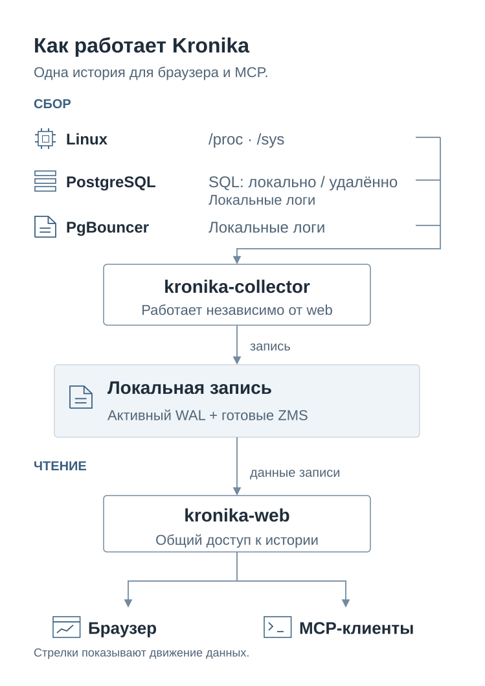
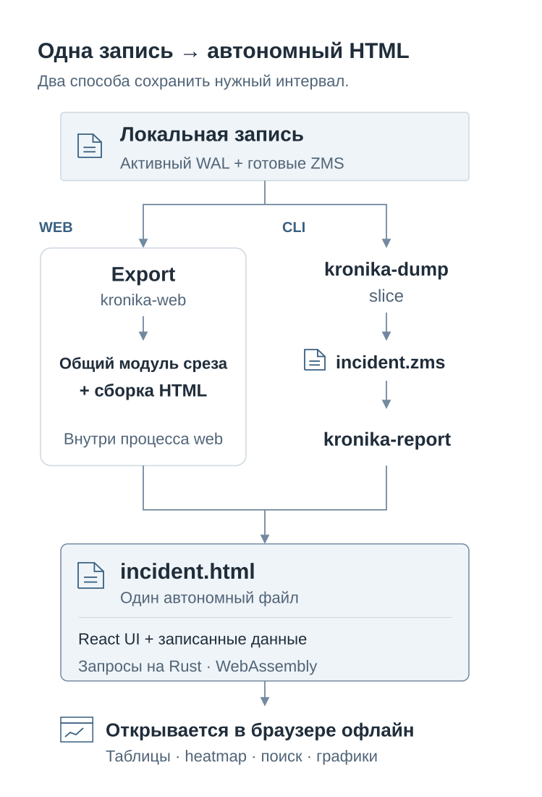

# Kronika

[English version](README.md)

**Вернитесь к замедлению Linux и PostgreSQL.** Kronika записывает процессы,
CPU, память, хранилище, сетевую активность, ожидания backend, SQL, планы
выполнения и события журналов. Откройте записанный час, найдите изменение
активности и проследите историю процесса, backend, запроса или отношения.


*Реальный час искусственной нагрузки: 5 сентября 2026, 19:00–20:00 UTC.
Heatmap помогает найти занятый интервал; таблица и Inspector показывают
выбранный объект у курсора. [Открыть эту запись](https://vadv.github.io/kronika-reports/reports/kronika-demo-hour-b3ac3ee.html)
можно для знакомства с интерфейсом. Для записи своей машины установите Kronika ниже.*

## Установить и запустить на своём хосте

Скачайте **готовый статический архив для Linux** своей архитектуры по
[руководству релизов](docs/releases.ru.md), затем проверьте, распакуйте и
установите его по [инструкции](INSTALL.ru.md). Rust, Node.js, Docker и база
данных не нужны.

**Состояние релиза:** опубликованный v1.0.0 ещё не содержит `--version`,
HTML-экспорт, `kronika-report` и `kronika-dump slice`. Текущий архив —
**кандидат из CI для проверки**, с commit в имени; новый публичный релиз
ещё не опубликован. Руководство указывает артефакты workflow и матрицу Linux.

После распаковки проверьте и установите программы:

```sh
sha256sum --check SHA256SUMS
for binary in kronika-collector kronika-web kronika-dump kronika-report kronika-demo; do
  "./$binary" --version
done
sudo install -d -m 0755 /usr/local/bin
sudo install -m 0755 kronika-collector kronika-web kronika-dump \
  kronika-report kronika-demo /usr/local/bin/
```

Начните с **Linux без БД** на машине, которую хотите исследовать:

```sh
sudo install -d -m 0700 /var/lib/kronika
sudo env KRONIKA_STORAGE_DIR=/var/lib/kronika \
  /usr/local/bin/kronika-collector
```

В другом терминале замените пароль и откройте web над той же записью:

```sh
sudo env KRONIKA_STORAGE_DIR=/var/lib/kronika \
  KRONIKA_WEB_LISTEN=127.0.0.1:8080 \
  KRONIKA_WEB_SOURCES=1 \
  KRONIKA_WEB_USER=kronika \
  KRONIKA_WEB_PASSWORD='replace-with-a-random-password' \
  /usr/local/bin/kronika-web
```

Откройте **<http://127.0.0.1:8080/>** и войдите. Сбор начинается сразу;
web читает активный журнал, поэтому ждать готового сегмента не нужно.
`sudo` даёт коллектору доступ к деталям процессов и локальным журналам;
запуск web под той же учётной записью сохраняет закрытые права хранения.
`Ctrl+C` останавливает любой из процессов, сохраняя запись.

Следующим шагом [подключите PostgreSQL](INSTALL.ru.md) через роль наблюдения
и `KRONIKA_PG_DSNS`; sources web `3` означает OS + PostgreSQL.
[Systemd](docs/services.ru.md) обеспечивает постоянный сбор с закрытыми
конфигурационными файлами. [Сборка из исходников](docs/build.ru.md) и
необязательное [Docker-демо](bins/kronika-demo/README.ru.md) описаны отдельно.

## Исследовать произошедшее

Начните с **когда**: выберите час и точку на его временной шкале. Затем
найдите **где**: ресурс с давлением, занятый процесс, ожидающий backend или
затратный запрос. Откройте историю выбранной строки и переходите к связанным
объектам. Kronika располагает наблюдения рядом; оператор решает, какие из них
относятся к одной проблеме.

| Вопрос | Что открыть |
| --- | --- |
| Какой процесс занимал машину? | **Processes**: режимы Tree, CPU, память, дисковый I/O и общий; поиск процессов, активность часа, записанная команда и контекст. |
| Какой ресурс был занят или задерживал работу? | **Host**: CPU, память, PSI, устройства, ёмкость mount, топология хранения и сеть. В контейнере первыми идут CPU, память, I/O и лимиты потоков собственного cgroup коллектора. |
| Что тогда делал PostgreSQL? | **Overview**, **Activity**, **Databases**: активные сессии, ожидания, возраст транзакций, трафик баз, WAL, обслуживание и записанные настройки. |
| Кто кого блокировал? | **Locks**: деревья holder/waiter, точные PID блокирующих, цели блокировок, SQL и записанный контекст backend. |
| Какой SQL занял интервал? | **Statements**: выполнение, вызовы, буферы, строки, планирование и WAL; полный SQL и переходы к записанным планам. |
| Как исполнялся запрос? | **Plans**: метрики каждого плана и записанный текст из `pg_store_plans`, связанные со Statements по Query ID. |
| Участвовало ли обслуживание? | **Vacuum**: эпизоды, фазы, прогресс и сопоставленная стоимость процесса. **Tables / Indexes**: активность, изменения, обслуживание, размер, буферы, группировка по базе, схеме и tablespace. |
| Что сообщили журналы? | **Events**: отметки метрик и группы событий PostgreSQL/PgBouncer; отдельные появления, запросы, отношения и держатели блокировок. |

[Руководство оператора](docs/operator-guide.ru.md) проводит по этим путям на
конкретных примерах публичного часа. [Справочник видов и управления](docs/features.ru.md)
объясняет все поверхности, режимы, группировки, графики, пороги и небольшие
элементы: фиксированный час и курсор, Browser/UTC, обновление, Find,
сортировку, шкалы heatmap, Total/Other, историю строки, Inspector,
клавиатуру и мобильные представления.


*Statements связывает занятый интервал с конкретным SQL. Метрики поступают
из установленного поддерживаемого расширения `pg_stat_statements`.*


*Plans использует поддерживаемую установку `pg_store_plans`. В этой публичной
записи Plans Activity завершается ошибкой: идентификатор плана повторяется
в одной временной точке. Таблица и Inspector выбранного плана работают;
руководство явно описывает ограничение и использует эти виды.*

## Записать сейчас, разобраться позднее

<picture>
  <source media="(prefers-color-scheme: dark)" srcset="docs/images/architecture-ru-dark.svg">
  
</picture>

Коллектор работает на наблюдаемом Linux-хосте и пишет локальные файлы.
Web читает их для браузера и **MCP**: тот же процесс обслуживает
`http://127.0.0.1:8080/mcp` с той же аутентификацией. Настройки клиента
находятся в панели **AI** и [руководстве MCP](docs/mcp-clients.ru.md).
Инструменты возвращают записанные рейтинги, строки, историю, определения и
события; они не опрашивают работающий PostgreSQL или текущее состояние хоста.

Коллектор рассчитан на **менее 25 MiB пикового RSS на обычном хосте** и
записывает пик памяти в лог при каждой записи сегмента. Цель retention
по умолчанию — **2 GiB**, включая журналы, сжатые записи и индексы.
Один замер нагрузки примерно с 500 таблицами и 3000 индексами дал
экстраполяцию **184 MB/день** готовых сжатых сегментов; это не универсальная
оценка размера. [Настройки хранения](bins/kronika-collector/README.ru.md)
объясняют замер и состав retention.

## Поделиться интервалом

Нажмите **Export** в web, чтобы скачать выбранный интервал одним
интерактивным HTML-файлом. Коллега откроет его прямо в браузере, без Kronika,
сервера и сети. Таблицы, heatmap, поиск и графики остаются интерактивными.
Файл содержит выбранные записанные данные; передавайте его с теми же
ограничениями доступа, что и саму запись.

<picture>
  <source media="(prefers-color-scheme: dark)" srcset="docs/images/report-export-ru-dark.svg">
  
</picture>

Для сохранённых файлов и скриптов [dump](bins/kronika-dump/README.ru.md)
показывает содержимое записи и вырезает интервал, а
[report](bins/kronika-report/README.ru.md) создаёт HTML. Встроенный движок
Rust/WebAssembly работает в **главном потоке браузера**. В статических
отчётах нет MCP и живого обновления.

## Документация

- **Начало:** [Установка](INSTALL.ru.md) · [Архивы Linux и проверенные системы](docs/releases.ru.md)
  · [Systemd](docs/services.ru.md) · [Сборка из исходников](docs/build.ru.md)
- **Работа:** [Исследовать час](docs/operator-guide.ru.md) · [Виды и управление](docs/features.ru.md)
  · [MCP-клиенты](docs/mcp-clients.ru.md)
- **Настройка:** [Collector](bins/kronika-collector/README.ru.md) · [Web](bins/kronika-web/README.ru.md)
- **Утилиты:** [Demo](bins/kronika-demo/README.ru.md) · [Dump](bins/kronika-dump/README.ru.md)
  · [HTML-отчёты](bins/kronika-report/README.ru.md)
- **Записанные поля:** [Linux](docs/type-registry/os.ru.md) · [Метрики PostgreSQL](docs/type-registry/postgresql-metrics.ru.md)
  · [События PostgreSQL](docs/type-registry/postgresql.md) · [События PgBouncer](docs/type-registry/pgbouncer.md)
- **Устройство:** [Принципы и контракты](DESIGN.ru.md) · [Формат сегмента](crates/kronika-format/README.ru.md)

Kronika распространяется по [лицензии MIT](LICENSE).
