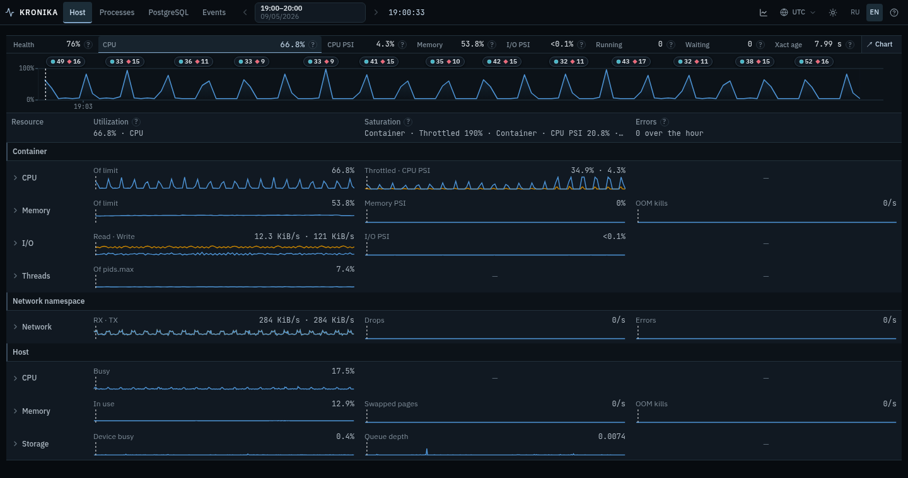
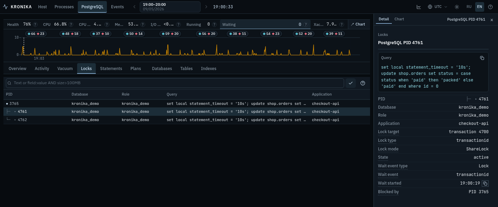

# Разобрать записанный час

[English version](operator-guide.md) · [Экраны и управление](features.ru.md) · [README](../README.ru.md)

Kronika позволяет вернуться к прошлому состоянию машины: какие ресурсы были
заняты, какие процессы присутствовали, что делали backends PostgreSQL и что
рядом с этим попало в логи. Начните со времени и вопроса, сохраняйте время
при переходах между экранами, затем сузьте просмотр до процесса, запроса или
отношения. Результат — записанные наблюдения, которые можно объяснить
и передать другому оператору.

Для собственной машины сначала пройдите [установку](../INSTALL.ru.md).
Запустите коллектор с явно указанным хранилищем и доступом, необходимым
источникам ОС; откройте `kronika-web` на localhost над этим хранилищем.
Для начала достаточно OS. Добавьте PostgreSQL DSN, когда понадобится история
БД этой машины. Просмотр чужой записи не расскажет, что произошло на вашей.

**Порядок чтения:** [Выбор часа](#сначала-выберите-час-затем-интерпретируйте-числа) →
[Поиск ресурса](#найдите-где-и-когда-изменилась-работа) → [Час и курсор](#используйте-час-и-курсор-вместе) →
[Практические примеры](#примеры-из-настоящей-публичной-записи) →
[Продолжение разбора](#продолжите-разбор-через-обслуживание-хранилище-и-логи) → [Передача](#сохраните-и-передайте-наблюдения)

## Сначала выберите час, затем интерпретируйте числа

1. Выберите день и час происшествия. Горизонтальная шкала — весь этот час,
   а не автоматически растянутый диапазон доступных точек.
2. Выберите **UTC** для сопоставления с UTC-логами и примерами ниже. Время
   браузера следует его часовому поясу. Час задаёт дату, поэтому большинство
   значений показывают только время; значение за пределами дня содержит дату.
3. Выберите момент на шкале. Часы вверху — курсор, а не обещание, что каждый
   источник снят в точности в эту микросекунду.
4. Прочитайте справку и единицу метрики. Доля CPU, время CPU, throughput,
   счётчик с момента сброса статистики и интервальное среднее отвечают на
   разные вопросы.
5. Сохраните момент при переходе на другой экран. По возможности переходите
   по записанным ID и сравнивайте время снимка/интервал в Inspector.

Более частый OS-снимок и более редкий снимок PostgreSQL могут находиться под
одним курсором. Обычно значение берётся из последнего снимка не позже него;
контекст process→Activity отдельно указывает ближайший записанный снимок
точного PID. Поэтому общая сводка и выбранный backend не обязательно
одновременные наблюдения. Стрелки ←/→ сравнивают настоящие записанные моменты,
не создавая промежуточных значений.

**Обновление относится к новым записям.** Видимый текущий час обновляется
каждые 15 секунд после окончания предыдущей загрузки; скрытая страница
останавливается и обновляется при возвращении видимости. Зафиксированный
курсор остаётся выбранным. Курсор, следующий за последним наблюдением,
продвигается с новыми данными. Час автоматически не переключается на следующий.
Исторические часы не опрашиваются, самостоятельный HTML заморожен. Открытие
истории читает другую часть выбранной записи, а не обновляет и не повторяет
нагрузку.

## Найдите, где и когда изменилась работа

Компактная шкала помогает выбрать период; затем откройте **Host**.
Таблица USE разделяет использование ресурса, ожидание ресурса и записанные
ошибки. Раскройте ячейку ресурса, изучите состав и историю, затем конкретное
устройство, интерфейс или cgroup, если они относятся к вопросу.

| Первое наблюдение | Следующие полезные экраны | Что сравнить |
| --- | --- | --- |
| Растёт CPU или ожидание планировщика | Host CPU → Processes CPU → процесс | Занятые ядра, CPU PSI/run delay, команду и историю процесса. |
| Растёт память или записан OOM | Host Memory → Processes Memory → RSS Activity | Available/charged memory, лимиты, swap и команды, вносящие вклад в RSS. |
| Растёт очередь хранилища или I/O wait | Host Storage I/O → устройство → Processes Disk | Throughput/latency устройства, точный mount и storage bytes процесса. |
| Растёт параллелизм PostgreSQL или возраст транзакции | Overview → Activity → Locks | Active и waiting, transaction age и query duration, идентичности holder/waiter. |
| Запрос доминирует по execution или temporary writes | Statements Activity → строка → Plans → Tables/Indexes | Вклад за час, интервальную работу на вызов, записанный план, активность и размер отношений. |
| Обслуживание совпадает с занятым периодом | Vacuum → Process эпизода → Tables Maintenance → Events | Фазу/прогресс, записанные изменения ресурсов процесса и лог обслуживания. |
| Возникают ошибки или всплеск логов | Events → группа → характерное событие | Точный текст/время и показания ресурса/backend рядом с ними. |

Цветное значение или маркер — точка входа. Справка объясняет фиксированную
границу; обычный рост работы не обязательно является ошибкой. Kronika не
утверждает, что две совпавшие линии объясняют друг друга. Запишите время,
область и изменение прежде, чем выбирать дальнейшее действие за пределами
просмотрщика.

## Используйте час и курсор вместе

Таблица показывает, что присутствовало под курсором. Activity над ней
ранжирует вклад всего часа. Начните с **Общей шкалы**, чтобы сравнить величины;
переключите **По строкам**, чтобы сравнить время активности внутри каждой
строки. Вернитесь к общей шкале, прежде чем оценивать, кто сделал больше работы.

Нажмите занятую ячейку для выбора записанного момента, затем строку для
фильтрации таблицы. Команда может объединять много PID, включая уже
завершившиеся процессы. Выберите один PID для Inspector, используйте Tree
для родительского контекста. Total включает непоказанные строки; Other —
остаток этого итога, а не дополнительная нагрузка.

Для CPU итог часа — накопленное время CPU, ячейки — время CPU на секунду
настенных часов. Для RSS итог — средняя суммарная резидентная память на
записанных снимках процессов, ячейки сохраняют интервальные показания.
Среднее RSS и итог CPU полезны рядом именно потому, что измеряют разные
вещи. Сохраняйте единицу рядом с показанием.

Поиск сужает объекты, линза — колонки, график открывает историю. Например,
в Processes примените `command:postgres*`, переключайтесь между CPU и Disk,
выберите строку и метрику её истории. Очистка поиска вернёт таблицу целиком.
При ожидании или ошибке запроса прочитайте статус, прежде чем считать
оставленные строки новым результатом.

## Примеры из настоящей публичной записи

Все примеры используют одну замороженную запись **5 сентября 2026,
19:00–20:00 UTC** настоящей Linux/PostgreSQL-нагрузки демо. Это наблюдения
генератора нагрузки, а не измерения production-происшествия. Скриншоты
получены из этой записи; числа округлены интерфейсом. Откройте ссылки,
выберите UTC и повторите шаги. Данные не меняются вместе с датой браузера.

### 1. Занятый контейнер не означает столь же занятый host

[Открыть Host в 19:00:33 UTC](https://vadv.github.io/kronika-reports/reports/kronika-demo-hour-b3ac3ee.html?at=1788634833931637&view=host).
CPU контейнера показывает **66,8% своего лимита**, Host CPU — **17,5% busy**.
Память контейнера — **53,8% лимита**, память Host — **12,9% in use**.
У этих процентов разные знаменатели.



1. Прочитайте заголовки областей: Container, Network namespace, Host.
2. Раскройте Container CPU. Под этим курсором **Throttled 34,9%** находится
   рядом с **CPU PSI 4,3%**. Первое описывает ограничение квотой, второе —
   ожидание ресурса. Ни одно не является загрузкой CPU host.
3. Раскройте Host CPU и сравните его историю и мощность. Отсутствующий лимит
   cgroup нельзя заменять числом online CPU host.
4. Раскройте Container I/O или Network namespace для их собственных измерений.
   Здесь namespace показывает **284 KiB/s RX и 284 KiB/s TX**. Два направления
   не устанавливают вдвое больший внешний трафик.

Пример разделяет три вопроса: сколько использовано от выделенного контейнеру,
сколько времени работа ждала и насколько был занят нижележащий host.

### 2. Найдите вклад команды за час, затем отдельный процесс

[Открыть Processes CPU в 19:03:39 UTC](https://vadv.github.io/kronika-reports/reports/kronika-demo-hour-b3ac3ee.html?at=1788635019201666&lens=cpu).
Раскройте **Processes Activity → CPU time**.


Группа `postgres` включает **517 PID** за час и накапливает **9,44 мин** CPU.
`kronika-demo` накапливает **4,75 мин**, Total — **14,6 мин**.
В выбранной ячейке `postgres` показывает **953 мс/с**, `kronika-demo` —
**79,8 мс/с**. Это скорости ячейки, а не итог часа, поделённый на время
жизни одного процесса.

1. Оставьте общую шкалу для сравнения величин групп.
2. Нажмите `postgres`, чтобы отфильтровать текущие процессы команды;
   изучите PID, затем его Activity-контекст, если он есть. Число группы
   за весь час не означает 517 одновременных backends.
3. Очистите фильтр и выберите PID **64**, `/usr/local/bin/kronika-demo`.
   В показанном снимке user CPU — **0,12 ядра**, system CPU — **0,006 ядра**.
   Эти значения точечного интервала не обязаны совпадать с минутной ячейкой.
4. Переключите Activity на RSS. Прочитайте заголовок **Среднее** и сравните
   вклад команды в резидентную память за час; затем в Memory посмотрите
   RSS конкретного PID под курсором и его историю.
5. Disk read/write bytes отделяют работу с хранилищем от логического I/O,
   обслуженного памятью.

Рейтинг команд находит работу, которую пропустил бы просмотр только процессов,
доживших до конца часа; таблица и Inspector сохраняют контекст отдельного PID.

### 3. Нормализованный запрос ведёт к записанному текстовому плану

[Открыть Statements в 19:00:33 UTC](https://vadv.github.io/kronika-reports/reports/kronika-demo-hour-b3ac3ee.html?at=1788634833931637&view=pg.statements).
Раскройте Activity с **Execution time**, затем выберите поиск заказов клиента:

```sql
select id, status, total_cents from shop.orders
where customer_id = $1 order by placed_at desc limit $2
```


Его Query ID — **`-665077864269413128`**. Вклад Activity за час —
**16,7 мин** execution time. Расчётный интервал таблицы —
**19:00:28 → 19:00:33**, **120 calls/s**, **1,42 с/с** execution time и
**11,9 мс/вызов**. Накопленное время выполнения может превышать секунду
настенных часов при параллельных вызовах; это не загрузка CPU.

1. Переключите Per call, чтобы отличить частые недорогие вызовы от дорогих
   отдельных выполнений. I/O и Resources покажут shared-buffer, temp и WAL
   без изменения курсора.
2. Используйте **Открыть планы** или ссылку Query ID. Видимый поиск целевого
   экрана выбирает записанные планы этого запроса. Выберите Plan ID
   **`1544266440`**.
3. Прочитайте записанный текст Inspector. План содержит `Parallel Seq Scan on
   orders`, `Sort` по `placed_at DESC`, `Gather Merge` и `Limit`; в нём
   записаны `Workers Planned: 1` и фильтр `(customer_id = 4244)`.
4. Вернитесь по связанным Statements или кнопкой Назад браузера.
   Параметризованный SQL и конкретный фильтр плана относятся к своим
   записанным формам; просмотрщик не запускает EXPLAIN заново.
5. В Tables найдите `schema:shop AND table_name:orders`. Изучите Access,
   Size and buffers и связанные Indexes; при разборе изменений сравните
   более поздний записанный момент. Само наличие sequential scan не
   устанавливает объяснение измеренного времени выполнения.


**Известное ограничение часа:** Plans Activity возвращает ошибку из-за
повторяющихся идентичностей, записанных `pg_store_plans`. Использованные выше
таблица и Inspector выбранного плана работают. Ошибка не означает нулевую
активность; менять область ради её сокрытия не нужно. Пример не делает
утверждений о почасовом рейтинге планов, который не удалось прочитать.

### 4. Ожидающий запрос и idle-транзакция могут быть в одной цепочке

[Открыть Locks в 19:00:33 UTC](https://vadv.github.io/kronika-reports/reports/kronika-demo-hour-b3ac3ee.html?at=1788634833931637&view=pg.locks).
У записанной цепочки корень PID **3765**, `idle in transaction`, и ожидающие
PID **4761**, **4762**, `active`, wait type **Lock**, event **transactionid**,
mode **ShareLock**, target **transaction 4700**. Оба начала ожидания —
**19:00:19**. Записанное приложение — `checkout-api`.



1. Выберите ожидающую строку и прочитайте блокирующие PID и полный контекст SQL.
2. Изучите корень. `idle in transaction` отличается от завершённой транзакции:
   строка всё ещё участвует в записанной цепочке блокировок.
3. Сравните query duration, transaction duration и state в Activity этого
   периода; контекст процесса покажет использование ресурсов Linux.
4. В Events найдите lock-wait группы рядом с этим периодом. Откройте
   характерное событие для записанного текста и времени. PID держателя
   из лога сам по себе не содержит SQL держателя.
5. Перейдите по следующим записанным моментам и посмотрите изменения строк.
   Сравнивайте фактические снимки источников, а не только общую сводку шкалы:
   источники собирались не одновременно.

Цепочка устанавливает записанную связь держателя и ожидающих. SQL и контекст
приложения дают следующие конкретные объекты для разбора.

## Продолжите разбор через обслуживание, хранилище и логи

Когда запрос затрагивает большое или активное отношение, Tables даёт больше,
чем размер. Access показывает scans, Changes — изменения и dead-row estimates,
Maintenance — число и время vacuum/analyze, Freeze — возраст транзакций.
Группировка по базе или схеме сравнивает суммарную активность, затем позволяет
спуститься к таблице. Её Indexes открывает usage, size/buffers, state и
записанное определение. Низкое число scans за час описывает эту запись,
а не всю историю использования индекса.

Vacuum хранит эпизоды всего часа, включая завершённые. Выберите эпизод,
сравните последовательность фаз и scanned-heap progress, затем откройте
Process. Изменения OS вычисляются по совпавшему PID из снимков не позже
границ эпизода. Backend ручного VACUUM мог выполнять другую работу в этом
промежутке. Цвет фазы определяется её смыслом в PostgreSQL, а неизменный
счётчик прогресса говорит только о неизменных записанных показаниях.
Events добавляет лог autovacuum/autoanalyze рядом с этими измерениями.

Для хранилища переходите по точному `major:minor`, mounts и записанным связям
слоёв. Cgroup и физическое устройство могут учитывать то же I/O на разных
уровнях: прежде чем складывать числа, прочитайте цепочку в Inspector.
Для WAL разделяйте генерацию байтов, результаты архивации и текущий размер
каталога `pg_wal`. Для сети сохраняйте namespace и направление рядом с числом.
Так визуально соседнее значение не становится посторонним знаменателем
или продублированным итогом.

В Events раскрытие группы показывает число и структуру, открытие характерного
события получает полную записанную строку. Ищите по источнику, категории или
тексту, смотрите first/last и нажимайте минутную полосу. Выбранный кластер
шкалы сужает консоль до интервала и его источников; очистка возвращает час.
PgBouncer представлен группами логов с точными сообщениями и контекстом
соединения. У него нет отметок на общей шкале, поэтому отсутствие там
не означает пустую консоль PgBouncer.

## Сохраните и передайте наблюдения

Полезная передача содержит час/часовой пояс, экран и ID объекта, измеренное
значение с единицей и интервалом, нужный записанный текст и ссылку.
Если запись устанавливает только совместный рост, так и напишите:
«эти значения выросли вместе в такие-то записанные моменты».
Сохраняйте явное указание отсутствующего поля или неудачного чтения.

Скопируйте URL для оператора с доступом к тому же web-серверу.
Для самостоятельной передачи используйте **Экспорт** своего web,
проверьте интервал и скачайте интерактивный HTML. Он содержит все записанные
секции интервала, включая SQL, логи и командные строки. Получатель может
открывать экраны и выбирать объекты без коллектора и web-сервера.
HTML остаётся замороженным и не имеет живого MCP endpoint.
CLI-срезы и создание отчёта — дополнительный путь в
[руководстве по выпуску](releases.ru.md).

Для внешнего AI-клиента используйте **Подключить AI-агента** и
[руководство MCP](mcp-clients.ru.md). Попросите перечислить записанные
границы/секции, ранжировать конкретную метрику в явном интервале,
найти объект в записанном моменте и получить детали выбранной строки.
Инструменты читают те же записи, а не текущую production-систему
и не выполняют исправляющих команд. [Справочник](features.ru.md)
перечисляет все выпущенные инструменты, экраны, линзы и управления.
